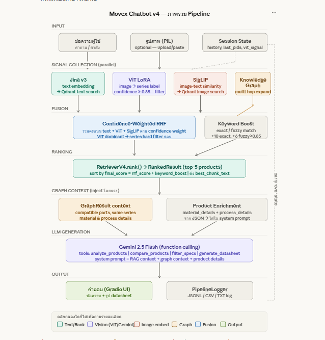

<<<<<<< HEAD
# sv

Everything you need to build a Svelte project, powered by [`sv`](https://github.com/sveltejs/cli).

## Creating a project

If you're seeing this, you've probably already done this step. Congrats!

```sh
# create a new project
npx sv create my-app
```

To recreate this project with the same configuration:

```sh
# recreate this project
npx sv@0.12.5 create --template minimal --types ts --add tailwindcss="plugins:none" --install npm frontend
```

## Developing

Once you've created a project and installed dependencies with `npm install` (or `pnpm install` or `yarn`), start a development server:

```sh
npm run dev

# or start the server and open the app in a new browser tab
npm run dev -- --open
```

## Building

To create a production version of your app:

```sh
npm run build
```

You can preview the production build with `npm run preview`.

> To deploy your app, you may need to install an [adapter](https://svelte.dev/docs/kit/adapters) for your target environment.
=======
# Movex Sales AI Chatbot

AI chatbot สำหรับช่วยค้นหาและแนะนำผลิตภัณฑ์ Movex (โซ่ & สเปรอคเก็ต) โดยรับ input ทั้ง **ข้อความ** และ **รูปภาพ**

## Pipeline Overview



### Multi-Signal Retrieval (RetrieverV4)

| Signal | Model | หน้าที่ |
|--------|-------|---------|
| Text Embedding | `jinaai/jina-embeddings-v3` | ค้นหาจาก text query |
| Image Classification | ViT LoRA (`movex-lora-tuned-3`) | จำแนก series จากรูปสินค้า |
| Image-Text Matching | `google/siglip-base-patch16-224` | จับคู่รูปกับ text |
| Knowledge Graph | SQLite KG | multi-hop relationship (chain ↔ sprocket) |
| Vector DB | Qdrant | เก็บ embeddings ของ text chunks และรูปภาพ |
| LLM | `gemini-2.5-flash` | สร้าง response และ function calling |

## Project Structure

```
chatbotgit/
├── chatbot_v4.py              # Main chatbot (Gradio UI + Gemini)
├── retriever_v4.py            # Multi-signal retrieval pipeline
├── knowledge_graph.py         # Knowledge graph (chain-sprocket relations)
├── pipeline_logger.py         # Logging pipeline
├── extracted_data_v3_machine_ready.json  # Product database (JSON)
├── movex_kg.db                # Knowledge graph (SQLite)
├── qdrant_db/                 # Vector database
├── movex-lora-tuned-3/        # Fine-tuned ViT LoRA model
├── image/                     # Product images
├── evaphoto/                  # Evaluation test images
└── logs/                      # Pipeline logs
```

## Setup

### 1. Install dependencies

```bash
pip install -r requirements.txt
```

> **Note:** สำหรับ PyTorch ให้ติดตั้งตาม environment ของตัวเอง:
> - GPU (CUDA 12.1): `pip install torch==2.5.1+cu121 --index-url https://download.pytorch.org/whl/cu121`
> - CPU: `pip install torch==2.5.1`

### 2. ตั้งค่า environment variables

สร้างไฟล์ `.env` แล้วใส่ API key:

```env
GEMINI_API_KEY=your_gemini_api_key_here
```

### 3. รัน chatbot

```bash
python chatbot_v4.py
```

แล้วเปิด browser ไปที่ `http://localhost:7860`

## Models Required

| Model | Source |
|-------|--------|
| `jinaai/jina-embeddings-v3` | Hugging Face (auto-download) |
| `google/vit-base-patch16-224-in21k` | Hugging Face (auto-download) |
| `google/siglip-base-patch16-224` | Hugging Face (auto-download) |
| `movex-lora-tuned-3/` | ต้องมีในโฟลเดอร์ (LoRA weights) |
>>>>>>> main
